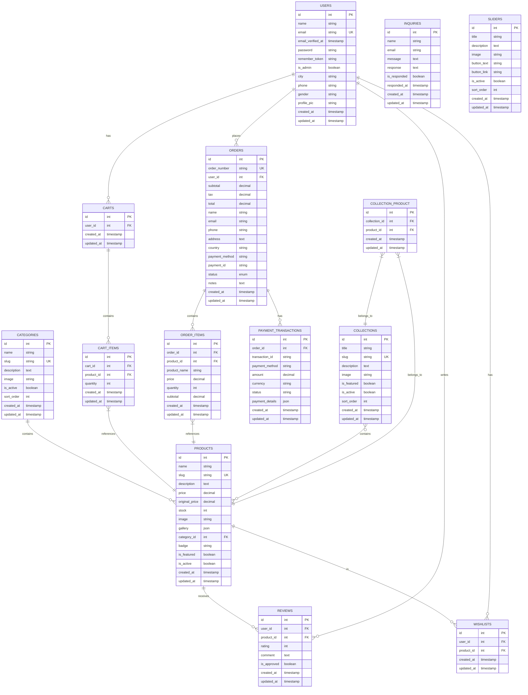

# Entity Relationship Diagram (ERD)

## Notes

- **PK**: Primary Key
- **FK**: Foreign Key
- **UK**: Unique Key
- Relationship notations:
  - `||--o{`: One-to-many relationship
  - `}o--o{`: Many-to-many relationship
  - `}|--||`: Many-to-one relationship

## Standard Laravel Tables (not shown in diagram)

- `password_reset_tokens`
- `failed_jobs`
- `personal_access_tokens`